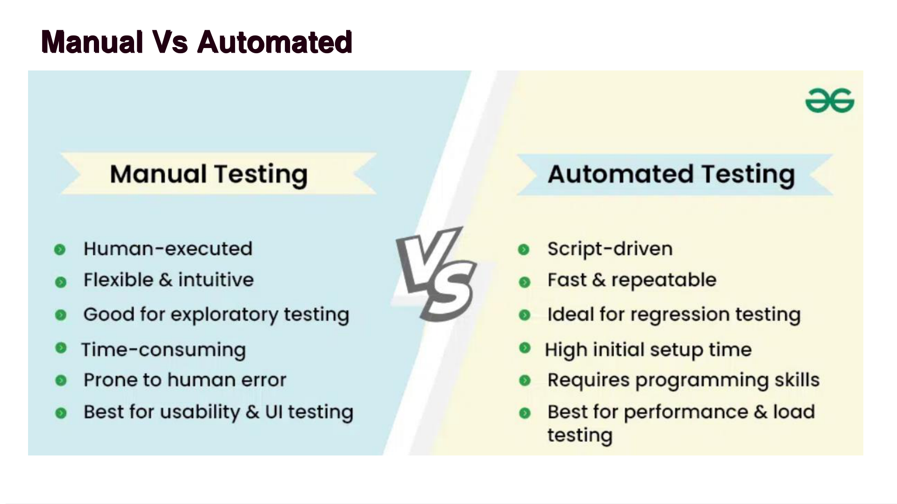
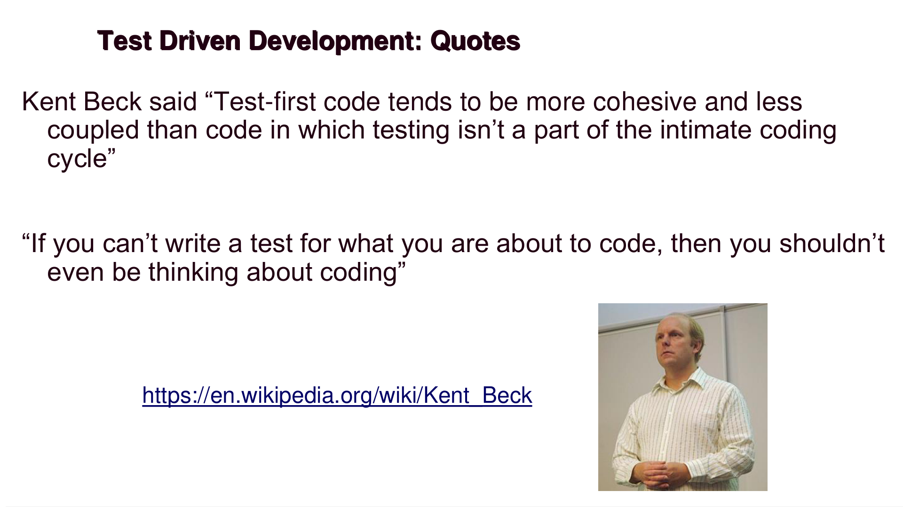
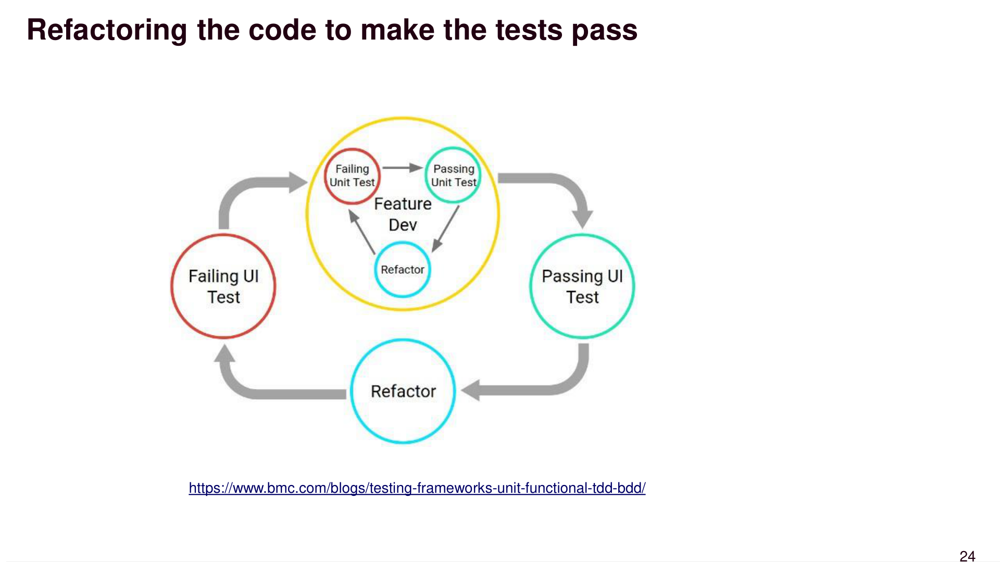
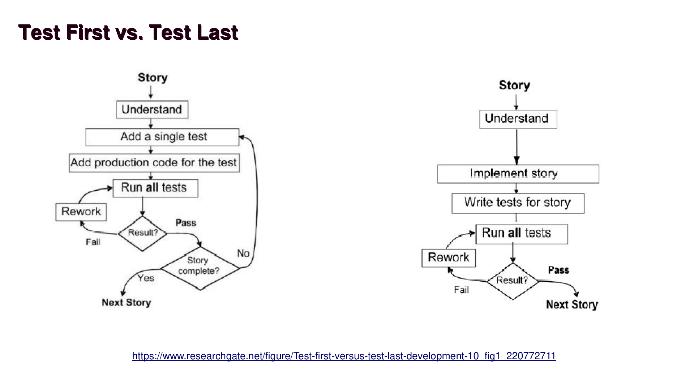

# Testing Techniques and Test Driven Development
**ICS499 – Software Engineering and Capstone Project**  
*Siva Jasthi | Computer Science and Cybersecurity | Metropolitan State University*

---

## Table of Contents
1. [Software Quality: QA vs QC](#1-software-quality-qa-vs-qc)
2. [Software Testing – Types](#2-software-testing--types)
3. [Manual vs Automated Testing](#3-manual-vs-automated-testing)
4. [Test Cases and Acceptance Criteria](#4-test-cases-and-acceptance-criteria)
5. [Test Driven Development (TDD)](#5-test-driven-development-tdd)
6. [Test First vs. Test Last](#6-test-first-vs-test-last)
7. [TDD Benefits](#7-tdd-benefits)
8. [TDD Limitations](#8-tdd-limitations)
9. [Summary](#9-summary)

---

## 1. Software Quality: QA vs QC

Software quality is maintained through two complementary disciplines:

| | Quality Assurance (QA) | Quality Control (QC) |
|---|---|---|
| **Focus** | Process-oriented | Product-oriented |
| **Question** | Are we doing things right? | Is it right? |
| **Approach** | Proactive — assure proper processes are followed | Reactive — after-the-fact verification |
| **Goal** | Do things right to produce the right thing | Validate the end product meets requirements |

> **Key Distinction:** QA is about building quality *into* the process, while QC is about finding defects *after* the fact.

---

## 2. Software Testing – Types

Software testing spans a wide range of techniques, each serving a distinct purpose within the development lifecycle. Rather than a flat list, it helps to understand these types by **category** — since many overlap, complement, or build upon one another. The categories below cover the original 35 types from the course material plus additional ones commonly encountered in professional software engineering.

---

### 🔬 Category 1: Structural / Code-Level Testing

These tests focus on *how* the code is built — its internal structure, logic, and execution paths.

| Testing Type | Description |
|---|---|
| **Unit Testing** | Tests individual components or functions in isolation. The smallest testable unit of code. |
| **Static Testing** | Examines code without executing it — includes code reviews, linting, and walkthroughs. |
| **Dynamic Testing** | Tests the software during actual execution to find runtime defects. |
| **White Box Testing** | Tests internal structures or workings of an application with full code visibility. |
| **Black Box Testing** | Tests functionality without any knowledge of internal code or logic. |
| **Gray Box Testing** ⭐ | A hybrid approach — the tester has *partial* knowledge of internals, enabling more targeted tests while maintaining a user-centric perspective. |
| **Mutation Testing** | Deliberately modifies ("mutates") source code to verify that test cases can detect the changes. |

> **White vs. Black vs. Gray:** Think of it as how much the tester can "see inside the box." White = full visibility, Black = none, Gray = partial.

---

### 🔗 Category 2: Integration Testing

These tests verify that separately developed modules work correctly when combined.

| Testing Type | Description |
|---|---|
| **Integration Testing** | Ensures that different modules or components work together correctly. |
| **Big Bang Integration Testing** ⭐ | All modules are combined at once and tested together after individual unit testing is complete. |
| **Top-Down Integration Testing** ⭐ | High-level modules are tested first; lower-level modules are simulated using *stubs*. |
| **Bottom-Up Integration Testing** ⭐ | Low-level modules are tested first; higher-level modules are simulated using *drivers*. |
| **Contract Testing** ⭐ | Verifies that interactions between services (especially microservices or APIs) conform to a shared contract. Critical in distributed/cloud architectures. |
| **End-to-End Testing** | Tests the entire application workflow from start to finish, simulating real user scenarios. |
| **System Testing** | Validates the complete, fully integrated system to ensure it meets all specified requirements. |

---

### ✅ Category 3: Functional Testing

These tests validate *what* the system does — whether features behave as specified.

| Testing Type | Description |
|---|---|
| **Functional Testing** | Verifies that the software functions as expected based on requirements. |
| **Acceptance Testing** | Validates the system against business requirements before release. |
| **User Acceptance Testing (UAT)** ⭐ | A formal subset of acceptance testing performed by *actual end-users* in their own environment to confirm the software meets their needs before go-live. |
| **Regression Testing** | Ensures that new code changes haven't broken existing functionality. |
| **Smoke Testing** | A quick, broad test to check if the build is stable enough for further testing. |
| **Sanity Testing** | Targeted checks to confirm that specific functionality works correctly after minor code changes or bug fixes. |
| **Install/Uninstall Testing** | Ensures that the software installs, updates, and uninstalls correctly across environments. |

---

### ⚡ Category 4: Performance & Reliability Testing

These tests examine how a system behaves under varying loads, stress conditions, and over time.

| Testing Type | Description |
|---|---|
| **Performance Testing** | Assesses speed, stability, and resource usage of a system under a specified workload. |
| **Load Testing** | Tests system behavior under expected and peak user load conditions. |
| **Stress Testing** | Pushes the system beyond normal limits to find its breaking point. |
| **Scalability Testing** | Tests the system's ability to scale up or down in response to increasing/decreasing workload. |
| **Concurrent Testing** | Tests the software with multiple users or tasks running simultaneously. |
| **Single User Performance Testing** | Establishes a performance baseline by testing with only one user. |
| **Reliability Testing** ⭐ | Checks whether software can operate continuously without failure for a specific period under defined conditions. |
| **Recovery Testing** | Ensures that a system can recover from crashes, hardware failures, or other major problems. |
| **Failover Testing** ⭐ | Specifically tests the system's ability to automatically switch to a backup system or component when the primary one fails. |
| **Disaster Recovery Testing** ⭐ | Validates that an organization can restore data and resume operations after a critical IT failure or complete disruption. |

---

### 🔐 Category 5: Security Testing

These tests identify vulnerabilities and verify that the system protects data and resists attacks.

| Testing Type | Description |
|---|---|
| **Security Testing** | Broadly identifies vulnerabilities and ensures data protection and system safety. |
| **Penetration Testing (Pen Testing)** | Simulates a real-world attack on the system to assess its security posture. |
| **Fuzz Testing (Fuzzing)** ⭐ | Feeds invalid, unexpected, or random data into inputs to uncover crashes, security holes, and edge-case bugs. Widely used in security research. |
| **Chaos Testing (Chaos Engineering)** | Intentionally introduces failures into a live system to test its resilience and recovery capabilities. |

---

### 🌍 Category 6: Compatibility & Localization Testing

These tests ensure the software works correctly across different environments, regions, and user populations.

| Testing Type | Description |
|---|---|
| **Compatibility Testing** | Ensures the software works across different devices, browsers, and operating systems. |
| **Accessibility Testing** | Ensures software is usable by people with disabilities (e.g., screen readers, keyboard-only navigation). |
| **Localization Testing (L10n)** ⭐ | Verifies correct behavior for a *specific* locale — including date/time formats, currency symbols, and translated text. |
| **Internationalization Testing (i18n)** ⭐ | Ensures the software can be adapted to *multiple* languages and regions without changes to the underlying source code. |
| **Compliance / Regulatory Testing** ⭐ | Verifies that software adheres to required industry standards, laws, or regulations (e.g., HIPAA, GDPR, PCI-DSS). |

---

### 👤 Category 7: User Experience & Acceptance Testing

These tests focus on whether the software is intuitive, useful, and meets real user needs.

| Testing Type | Description |
|---|---|
| **Usability Testing** | Ensures the software is user-friendly, intuitive, and efficient to use. |
| **A/B Testing** | Compares two versions of a system or feature to determine which performs better with real users. |
| **Alpha Testing** | Internal testing by developers or QA teams before releasing to external users. |
| **Beta Testing** | Testing performed by actual users in a real environment prior to general release. |
| **Exploratory Testing** | Simultaneous learning, test design, and execution — driven by tester intuition rather than scripts. |
| **Interactive Testing** | A human tester interacts directly with the application to uncover issues not captured by scripts. |
| **Ad-hoc Testing** | Unstructured, informal testing performed without formal plans or test cases — often used to quickly probe suspected issues. |

---

### 🧪 Category 8: Specialized & Emerging Testing Types

These are less common but increasingly important in modern software development.

| Testing Type | Description |
|---|---|
| **Non-functional Testing** | An umbrella category that validates system *qualities* — performance, usability, reliability — rather than specific features. |
| **Monkey Testing** ⭐ | Completely random, unguided inputs are sent to the system to see if it crashes or behaves unexpectedly. |
| **Gorilla Testing** ⭐ | One particular module is tested exhaustively and repeatedly from every angle to ensure extreme robustness. |
| **Operational Acceptance Testing (OAT)** ⭐ | Validates operational readiness before release — focusing on backup/restore, maintenance procedures, and system monitoring. |
| **Shift-Left Testing** ⭐ | A methodology/philosophy of testing *earlier* in the SDLC (shifting left on the timeline) to catch defects sooner and reduce cost of change. |

---

> ⭐ = Types added beyond the original 35 in the course slides.

> **How many testing types exist?** Industry sources catalog well over 100 named testing types, though many overlap or are context-specific variations of the categories above. The types listed here represent the most widely recognized and practically relevant ones for professional software engineering.

---

## 3. Manual vs Automated Testing

All of the testing types listed above can be performed either **manually** or through **automated** testing. Manual testing does not scale for large-scale enterprise products, and dedicated teams are typically needed to support the creation of automated tests.

### Comparison at a Glance

| Dimension | Manual | Automated |
|---|---|---|
| **Execution** | Human-executed | Script-driven |
| **Time** | Faster for quick tasks | Faster in the long run |
| **Money** | Cheaper for quick tasks | Cheaper in the long run |
| **Reliability** | Less | More |
| **Limitations** | Performance tests | Visual aspects |
| **Reusability** | Less | More |
| **Test Coverage** | Less | More |
| **Human Resources** | More | Less |
| **Programming Knowledge** | Unnecessary | Necessary |
| **Control & Debugging** | Easier | Difficult |
| **For Changes** | Small | Constant |
| **Tools** | Unnecessary | Necessary |

**Best use cases:**
- **Manual Testing** — Exploratory testing, usability & UI testing
- **Automated Testing** — Regression testing, performance & load testing

---

## 4. Test Cases and Acceptance Criteria

### Test Cases

A **test case** is a detailed description of a specific scenario or condition that needs to be tested to validate the functionality of a system or software component.

**Key characteristics of a test case:**
1. Focuses on a specific functionality, feature, or module of the system.
2. Includes detailed steps, inputs, and expected outputs.
3. Identifies any preconditions or dependencies required for the test.
4. Can be automated or executed manually.
5. Helps identify defects or issues in the system.

### Acceptance Criteria

**Acceptance criteria** are a set of conditions or requirements that a system or software must meet to be accepted by stakeholders or customers. They are established in collaboration between the development team and the stakeholders to ensure that the project meets the desired goals and objectives.

**Key characteristics of acceptance criteria:**
1. Focuses on the overall project or feature requirements.
2. Describes high-level conditions or outcomes that must be satisfied.
3. Usually written in non-technical language understandable to stakeholders.
4. Determines whether the project meets the business and user needs.
5. Helps stakeholders evaluate and accept the final product.

> **Difference:** Test cases are *technical and granular* (how to test), while acceptance criteria are *business-focused and high-level* (what must be true for the feature to be accepted).

---

## 5. Test Driven Development (TDD)

### Key Quotes

> *"Test-first code tends to be more cohesive and less coupled than code in which testing isn't a part of the intimate coding cycle."*
> — **Kent Beck** ([Wikipedia](https://en.wikipedia.org/wiki/Kent_Beck))

> *"If you can't write a test for what you are about to code, then you shouldn't even be thinking about coding."*

### Introduction

- Popularized by **Extreme Programming (XP)**
- A method of **developing** software, not just testing it
- Software is developed in **short iterations**
- **Unit tests are written FIRST**, before any production code

### The TDD Cycle (Red → Green → Refactor)

**Step 1 — Add a Test**
- Use cases and user stories are used to clearly understand the requirement
- Write a failing test that defines the desired behavior

**Step 2 — Run All Tests and See the New One Fail**
- Ensures the test harness is working correctly
- Confirms the test does not mistakenly pass without implementation

**Step 3 — Write Some Code**
- Write only the code designed to pass the test
- No additional functionality should be included (it would be untested)

**Step 4 — Run the Automated Tests and See Them Succeed**
- If tests pass, the programmer can be confident the code meets all tested requirements

**Step 5 — Refactor Code**
- Clean up the code
- Re-run tests to ensure the cleanup did not break anything

### TDD Refactoring Loop

The diagram above illustrates the continuous cycle:
- A **Failing UI Test** triggers **Feature Development**
- Within feature dev, the cycle is: Failing Unit Test → Passing Unit Test → Refactor
- Once the UI Test passes, refactoring at the outer level occurs before moving to the next feature

---

## 6. Test First vs. Test Last

| Step | Test First (TDD) | Test Last |
|---|---|---|
| 1 | Pick a piece of functionality | Pick a piece of functionality |
| 2 | Write a **failing test** for a small task | Write **production code** that implements entire functionality |
| 3 | Write **production code** until the test passes | Write **tests** to validate all functionality |
| 4 | Run all tests | Run all tests |
| 5 | Rework code until all tests pass | Rework code until all tests pass |

> **Key Insight:** In Test First, tests shape and constrain the implementation incrementally. In Test Last, the implementation is complete before tests are even considered — often leading to tests that are written to match the code rather than validate requirements.

---

## 7. TDD Benefits

### Instant Feedback
- Developers know **immediately** if new code works
- Quickly reveals if new code **interferes with existing** functionality

### Better Development Practices
- Encourages developers to decompose problems into **manageable, formalized tasks**
- Provides a context in which **low-level design decisions** are made thoughtfully
- By writing only the code necessary to pass tests, designs tend to be **cleaner and clearer**

### Quality Assurance
- Up-to-date tests ensure a **certain level of quality** at all times
- Enables **continuous regression testing**
- TDD drives programmers to write **automatically testable code**
- When a software defect is found, a **unit test is added before fixing** the code

### Lower Rework Effort
- Since the scope of a single test is limited, when a test fails, **rework is easier**
- Eliminating defects early **avoids lengthy debugging** later in the project
- The **"Cost of Change"** principle: the longer a defect remains, the more difficult and costly it is to remove

---

## 8. TDD Limitations

Despite its benefits, TDD is not a silver bullet:

- **Difficult in some situations** — GUIs, relational databases, and web services are hard to test-drive; they often require **mock objects**
- **Lacks upfront design** — The focus is on implementation, with less attention to overall logical structure
- **Blurs distinct phases** — TDD merges design, coding, and testing into one activity, which can reduce architectural clarity

---

## 9. Summary

- **TDD is effective** not only for software testing, but also for **clarifying the goals and scope** of what needs to be built
- It is **technology-driven** — based on the language and technology stack of your project, you can explore different **frameworks and tools** to apply TDD (e.g., JUnit for Java, pytest for Python, Jest for JavaScript)
- The core philosophy: **write the test first, then write just enough code to make it pass, then refactor**

---

*References: Kent Beck — [Wikipedia](https://en.wikipedia.org/wiki/Kent_Beck) | BMC Blogs — [Testing Frameworks](https://www.bmc.com/blogs/testing-frameworks-unit-functional-tdd-bdd/) | ResearchGate — [Test-first vs Test-last](https://www.researchgate.net/figure/Test-first-versus-test-last-development-10_fig1_220772711)*
